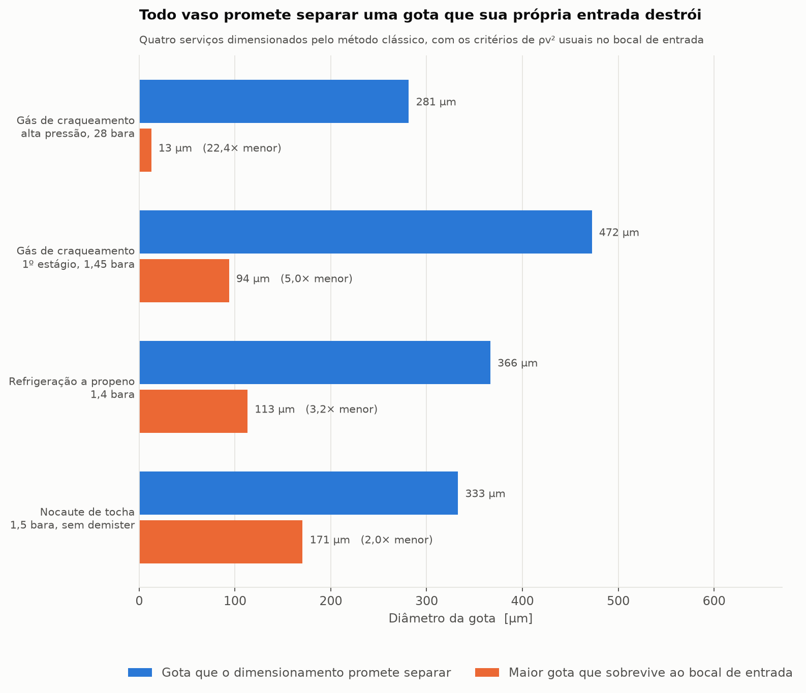

# Vaso de nocaute gás-líquido — dimensionamento e preparação do CFD

Dimensionamento de vaso separador gás-líquido (KO drum) vertical pelo método
clássico, e o material para submetê-lo a um estudo de CFD no Simcenter STAR-CCM+.

O pacote não existe para reproduzir Souders-Brown — isso é uma linha de planilha.
Ele existe para **desmontar** Souders-Brown e mostrar as três hipóteses que o
fator K esconde, que é o que justifica o estudo de CFD.

## O resultado

Vaso de sucção de compressor de refrigeração a propeno, 1,4 bara, −40 °C,
dimensionado com K = 0,25 ft/s. Sai um vaso de Ø2,40 m × 4,80 m T-T, operando a
99% do limite de Souders-Brown. Formalmente correto.

Desfazendo o fator K nas condições reais do vaso:

| | |
|---|---|
| Gota que o dimensionamento promete separar | **366 µm** |
| Maior gota que sobrevive ao bocal de entrada (We = 12 a 25 m/s) | **113 µm** |
| Razão | **3,2×** |

O vaso está dimensionado para separar uma gota que sua própria entrada não
produz. Nos quatro serviços do módulo a razão vai de 2,0× a 22,4×.



## Uso

```bash
pip install numpy scipy matplotlib

python3 scripts/relatorio_caso.py                      # caso principal + cartão do STAR-CCM+
python3 scripts/relatorio_caso.py --todos              # os quatro serviços
python3 scripts/relatorio_caso.py ko_drum_tocha
python3 scripts/gerar_figuras.py                       # figuras em figuras/
python3 -m unittest discover -s testes -t .            # 27 testes
```

Para um caso próprio, monte a `Corrente` com os dados da folha de dados do cliente:

```python
from vaso_separador import Corrente, Criterios, dimensionar_vaso_vertical
from vaso_separador.relatorio import relatorio

corrente = Corrente(nome="...", P_bara=..., T_C=..., MM=..., Z=...,
                    rho_l=..., mu_g=..., sigma=..., W_gas=..., W_liq=...)
print(relatorio(dimensionar_vaso_vertical(corrente, Criterios(fator_K="succao_de_compressor"))))
```

## Estrutura

| | |
|---|---|
| `vaso_separador/arraste.py` | Leis de arrasto, velocidade terminal, limite de Weber |
| `vaso_separador/souders_brown.py` | Fatores K com fonte declarada, correção de pressão, **o diâmetro implícito no K** |
| `vaso_separador/propriedades.py` | Massa específica do gás, bitolas de bocal, critérios de ρv² |
| `vaso_separador/dimensionamento.py` | Vaso vertical completo: diâmetro, alturas, bocais, avisos |
| `vaso_separador/casos.py` | Quatro serviços representativos de planta petroquímica |
| `vaso_separador/starccm.py` | Cartão de configuração do STAR-CCM+ derivado do dimensionamento |
| `vaso_separador/graficos.py` | Figuras, temas claro e escuro |
| `docs/base_normativa.md` | GPSA, API 521, API 617, NORSOK, NR-13 — e como amarrar o CFD a elas |
| `docs/roteiro_starccm.md` | Ordem de execução do estudo e onde parar para conferir |

## Rastreabilidade

Todo fator K, critério de ρv² e folga geométrica carrega o campo `fonte` e um
aviso `CONFIRMAR`, e os dois aparecem no relatório. São valores de prática
corrente que variam entre GPSA, API, NORSOK e a DEP de cada licenciador.
**Confira cada um na edição efetivamente adotada pelo cliente antes de emitir
documento de engenharia.**

Os casos em `casos.py` são representativos, montados a partir de literatura aberta
e ordens de grandeza típicas. Não são dados de nenhuma planta específica.

## Antes de confiar em qualquer resultado de CFD

Rode o teste de verificação da Fase 0 do roteiro: uma gota em gás parado, contra a
tabela analítica de velocidade terminal que o cartão gera. Tolerância de 1%. Se
não bater, o problema é de configuração, não de física.
